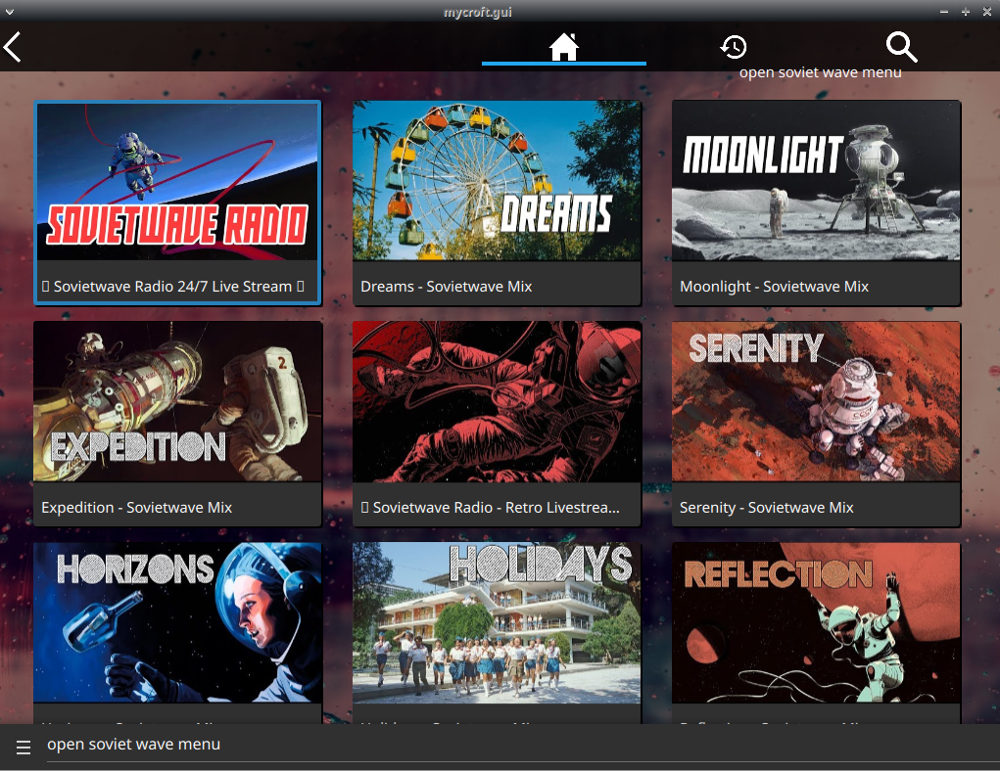

# SovietWave Skill

## About 

SovietWave Radio for mycroft

## Installation Notes

this requires [skill-better-playback-control](https://github.com/JarbasSkills/skill-better-playback-control), it will blacklist and replace the official mycroft skill

## Examples 

* "open sovietwave menu"
* "play sovietwave radio"

## Credits 
- JarbasAl
- [AIIX](https://github.com/AIIX/) - GUI 
- [SovietWave Radio](https://newsovietwave.com/)

## Category
**Entertainment**

## Tags
#music
#sovietwave
#radio
#entertainment